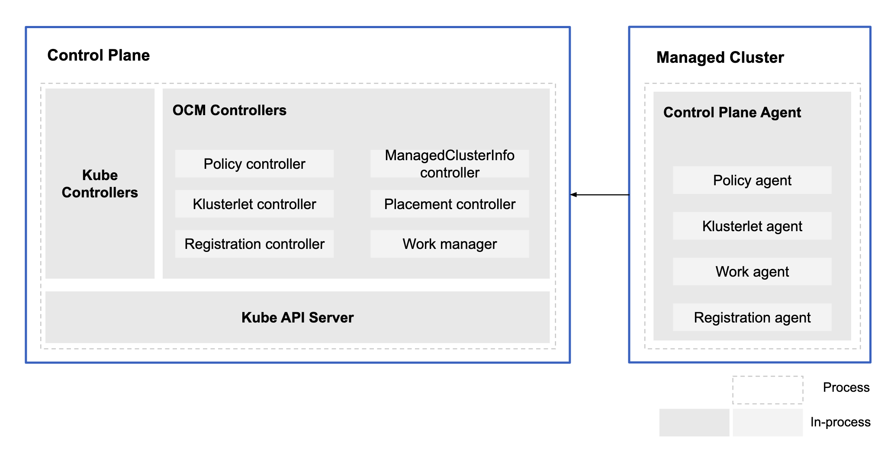

## Architecture Diagram


This repository is an extension to [open-cluster-management-io/multicluster-controlplane](https://github.com/open-cluster-management-io/multicluster-controlplane). It provides a way to run in-process components, which can provide some new capabilities to support auto-import the managed clusters and deploy the configuration policy on the matched managed clusters.

## Run multicluster-controlplane as a local binary

```bash
make run
```

## Deploy multicluster-controlplane in a cluster

### Prepare

1. An Openshift Cluster or a KinD cluster
2. Run the following command to check the required deploy tools

    ```bash
    make setup-dep
    ```

3. (Optional) Deploy an external etcd for multicluster-controlplane

    ```bash
    make deploy-etcd
    ```

    **Note**: If you deploy the etcd on the KinD cluster, you need set the environment variable `STORAGE_CLASS_NAME` to `standard`

    ```bash
    STORAGE_CLASS_NAME=standard make deploy-etcd
    ```

### Deploy

1. Set the environment variable `KUBECONFIG` to your cluster kubeconfig path

    ```bash
    export KUBECONFIG=<the kubeconfig path of your cluster>
    ```

2. (Optional) If your cluster is a KinD cluster, we will use `NODE_PORT` to expose multicluster-controlplane service, you need set your KinD cluster interal IP and `NODE_PORT` with the environment variables

    ```bash
    export EXTERNAL_HOSTNAME=$(docker inspect -f '{{range .NetworkSettings.Networks}}{{.IPAddress}}{{end}}' <the name of your KinD cluster>-control-plane)
    export NODE_PORT=<the node port of your KinD cluster>
    ```

3. (Optional) If you deployed the external etcd, set the environment variable `ETCD_MOD` to `external`

    ```bash
    export ETCD_MOD=external
    ```

4. (Optional) If you want to enable the self management, set the environment variable `SELF_MANAGEMENT` to `true`

    ```bash
    export SELF_MANAGEMENT=true
    ```

5. Run following command to deploy a multicluster-controlplane on your cluster

    ```bash
    make deploy
    ```

### Access the multicluster-controlplane

After the multicluster-controlplane is deployed, getting the multicluster-controlplane kubeconfig with following command to access the multicluster-controlplane

```bash
kubectl -n multicluster-controlplane get secrets multicluster-controlplane-kubeconfig -ojsonpath='{.data.kubeconfig}' | base64 -d > multicluster-controlplane.kubeconfig
```

Or if you deployed the multicluster-controlplane on an Openshift Cluster, you can delegate the authentication with your cluster kube-apiserver, run following command to set a context in your cluster kubeconfig

1. Login to your cluster with `oc login`

2. Create a new context in your cluster kubeconfig

    ```bash
    ocp_route=$(oc -n multicluster-controlplane get route multicluster-controlplane -o jsonpath='{.status.ingress[0].host}')
    oc -n openshift-kube-apiserver get cm kube-apiserver-server-ca -ojsonpath={'.data.ca-bundle\.crt'} > kube-apiserver-server-ca.crt
    oc config set-cluster multicluster-controlplane --server="https://${ocp_route}" --embed-certs --certificate-authority=kube-apiserver-server-ca.crt
    oc config set-context multicluster-controlplane --cluster=multicluster-controlplane --user=kube:admin --namespace=default
    ```

3. Specify the context when you access the `multicluster-controlplane`, e.g.

    ```bash
    oc --context multicluster-controlplane get managedclusters
    ```

## Join a cluster

### Join a cluster with defalut mode

```bash
export KUBECONFIG=<the kubeconfig path of your managed cluster>
export CONTROLPLANE_KUBECONFIG=<the kubeconfig path of your multicluster-controlplane>

make deploy-agent
```

### Join a cluster with hosted mode

1. Create a secret that contains your cluster kubeconfig on the multicluster-controlplane

```bash
export KUBECONFIG=<the kubeconfig path of your multicluster-controlplane>
export CLUSTER_NAME=<the name of your cluster>

kubectl create namespace $CLUSTER_NAME
kubectl -n $CLUSTER_NAME create secret generic managedcluster-kubeconfig --from-file kubeconfig=<the kubeconfig path of your managed cluster>
```

2. Create a klusterlet to import your cluster on the multicluster-controlplane

```bash
cat <<EOF | kubectl apply -f -
apiVersion: operator.open-cluster-management.io/v1
kind: Klusterlet
metadata:
  name: $CLUSTER_NAME
spec:
  deployOption:
    mode: Hosted
EOF
```

## Uninstall the multicluster-controlplane from your cluster

Run following command to uninstall the multicluster-controlplane from your cluster

```bash
make destroy
```

**Note**: Before you uninstall your controlplane, you may need to cleanup your managed clusters on the controlplane firstly.

- For hosted managed clusters, you can delete the klusterlet to cleanup the resource of your managed cluster
- For other managed clusters, you can delete the managed clusters to cleanup the resource of your managed cluster
